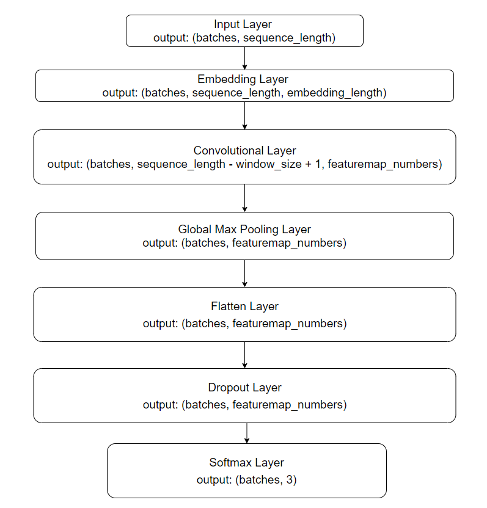
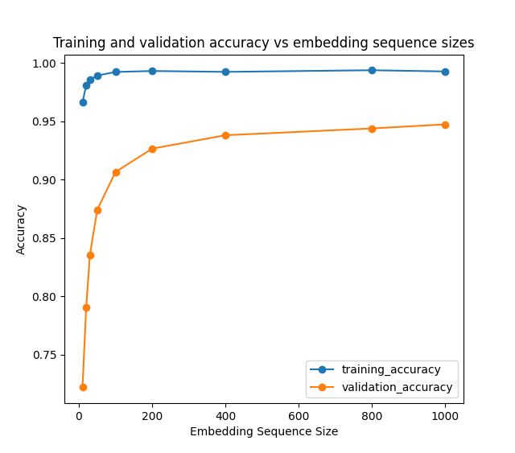
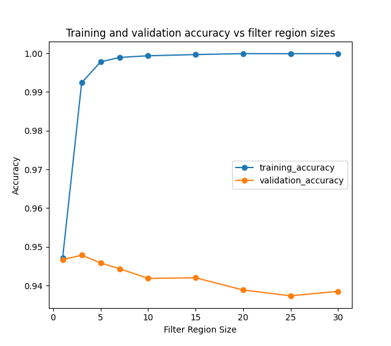
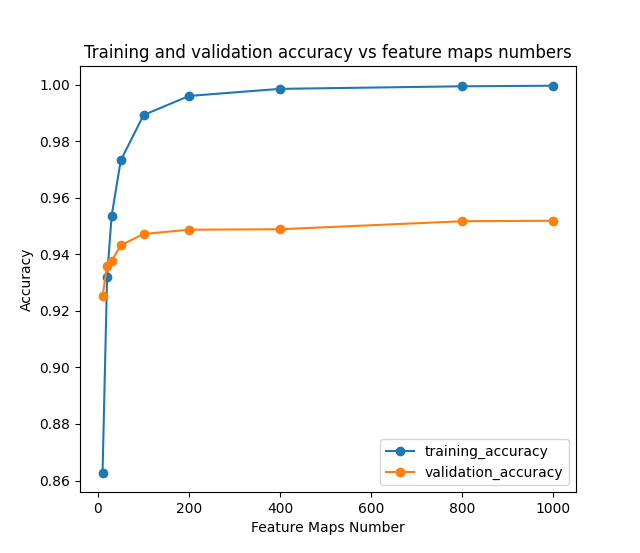
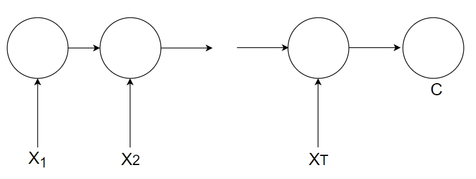
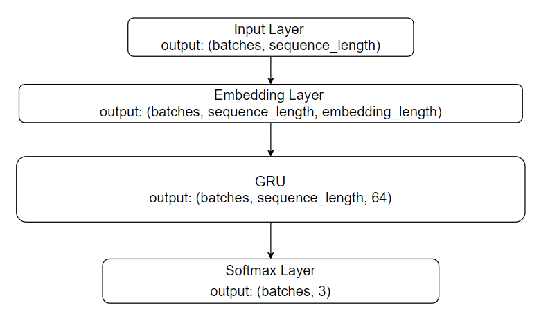

**Content Table:**
[toc]
---

### Python Files
- **create_CNN_model.py**: This files contains the python code to create the CNN model used for the experiments.
- **create_RNN_model.py**: This files contains the python code to create the RNN model used for the experiments.
- **tuning_CNN_model.py**: This files contains the python code for tuning the CNN model used for the experiments.

### 1. Tensorflow Keras Embedding Layer

The embedding layer is a special layer that is normally placed at the beginning of a neural network. Similar to W2V, it is an individual layer trained to work as a lookup table for the one-hot encoding input documents. The weights matrix represents the word embeddings. The documents which are made of the list of sequence would be converted into a stack of word vectors. We employ the average pooling layer to produce the mean word embeddings to represent a single document for normal W2V cases, but in our CNN model or RNN models, we would use more strategies to use the embedding layer’s output. Besides, the weights matrix of the embedding layer would be trained along with the other parameters of the neural network using the back-propagation method.

**Figure 1: Textual Model Structure using TensorFlow Keras Embedding Layer**
### 2. CNN 
As one of famous deep learning models, CNN has been widely used in computer vision tasks. Since the year of 2014, the CNN has been discovered to be proved successfully workable not only the computer vision jobs but also the text classification.

##### 2.1. Model Architecture

In our experiment, we implement a CNN model with its architecture designed based on the Yoon Kim’s architecture. The Embedding Layer works for training the word embeddings as it was been discussed previously. The Convolutional Layer has hundreds of feature maps as filters to convolute the document representation. The Global Max Layer is charged for keeping the most unique value to represent an independent document among all. The Dropout layer works as a regularization role. At last, the Softmax layer computes the probability distribution for three categories. We then classify the sample into the category which has the greatest value. In our experiments, we use the TensorFlow Keras deep learning library to implement this CovNet. 

**Figure 2: CNN model architecture**

##### 2.2. Hyperparameters Tuning
In order to find the CNN model that produces the highest prediction accuracy, we have tuned the model regarding three hyperparameters that are hugely affected the model’s performance: Sequence Size, Filter Region Size and Feature Maps numbers.

**Tuning Sequence Size:**

| Sequence Size   | Val_Acc |
| ----------- | ----------- |
|10|0.722|
|20|0.7905|
|30|0.835167|
|50|0.874|
|100|0.906667|
|200|0.926667|
|400|0.938167|
|800|0.944|
|1000|0.9475|

**Figure 3: CNN model train/validate Accuracy vs Embedding Sequence Sizes**
**Tuning Filter Region Size:**
| Sequence Size   | Val_Acc |
| ----------- | ----------- |
|1	|0.946667|
|3	|0.947833|
|5	|0.945833|
|7	|0.944333|
|10	|0.941833|
|15	|0.942|
|20	|0.938833|
|25	|0.937333|
|30	|0.9385|

**Figure 4: CNN model train/validate Accuracy vs Embedding Filter Region Sizes**
**Tuning Embedding Trainable Methods:**
| Trainable  | Val_Acc |
| ----------- | ----------- |
|non-static	|0.948667|
|static	|0.9475|

**Tuning Filter Feature Maps Numbers:**
|Feature Maps Numbers|Val_Acc|
| ----------- | ----------- |
|10|	0.925167|
|20|	0.936|
|30|	0.937667|
|50|	0.943167|
|100|	0.947167|
|200|	0.948667|
|400|	0.948833|
|800|	0.951667|
|1000|	0.951833|

**Figure 5: CNN model train/validate Accuracy vs Featuremaps Number**

**Configuration**
- Input word vectors:	GloVe 300d
- Static or non-static:	static
- Filter region size (window):	3
- Stride:	1
- Feature maps:	1000
- Activation function:	ReLU
- Pooling: 	GlobalMaxPooling
- Dropout rate:	0.5
- Optimizer:	Adam
- Batch size:	128
- Epochs:	20
- Cross Validation:	10-folds

### 3. RNN Model Architecture
##### 3.1. Encoder Architecture
Recurrent Neural Network (RNN) has long been used for learning the sequence of documents employing a directed node graph along temporal steps. We adopt the Encoder part of the RNN-Encoder-Decoder model as our RNN architecture since the architecture fits the requirement of the text classification task that documents can be input along with the temporal steps and in the end, the memory unit will produce a document representation. As seen from the figure 5, the encoder takes in a variable-length sequence 〖(X〗_1,X_2,…,X_T)and converts it into a fixed-length vector representation C. 

**Figure 6: RNN Encoder Model**

##### 3.2. GRU and LSTM
LSTM has a longer history than GRU. It was firstly introduced in 1997 and was modified throughout the time. New features like forget gate and peephole would add during the evolution. The GRU is a newer generation of RNN work similar to LSTM that enables memorizing the short-term and long-term dependencies by implementing a reset gate and an update gate during training. There is no memory cell as it is called in LSTM but has a hidden state works the same function. The figure 6 shows the inner structure of two memory units.

**Figure 7: Unit Comparison between naïve RNN, LSTM and GRU**

##### 3.3. Model Architecture
In our experiment, we implement a RNN decoder model with its architecture designed based on the Cho’s architecture. It works the same way as it was described in the CNN model’s section. The document-representation sends the batches of samples in the Input Layer at the beginning. After the embedding process by the Embedding Layer, the embeddings are continuously transferred to GRU layer. Through a recurrent time-based learning process using the Backpropagation method, the weights of the model would be updated. The final layer is the Softmax Layer which works to classify the samples into three categories.

**Figure 8: RNN-GRU model architecture**
As for memory unit, the Encoder model can use either Gated Recurrent Unit (GRU) or Long-short term Memory (LSTM) to memorize the historical dependencies as in the form of the hidden state.

### Appendix

##### A1. Other layers details
**Global Max Pooling Layer**
The output tensors from convolution layer yields concatenate results of each 128 filters’ hence the original matrix turns into the vector. For each sequence, we only keep the maximum value which maintains the review local feature.
**Concatenate Layer and Flatten Layer**
We concatenate all results of three types of filters and flatten readily for the neurons to take.
**Regularization: Dropout Layer**
We assign a Dropout Layer as regularization masks to help prevent overfitting issue.
**Fully Connected Layer**
We only assign a dense layer as the output layer using activation function of Softmax.

##### A2. TensorFlow Keras Summary
•	Utils.plot_model: Plot Model diagram. It requires pydot and graphviz, which should be installed to python lib and set executable directory into system environment path.
•	Optimizers: Provides different classes of optimize rule like ‘Adam’, ‘Adadelta’, etc.
•	Layers: All types of NN layers like ‘Flatten’, ‘Concatenate’, etc
•	Experimental.preprocessing.TextVectorization

##### A3. GPU Acceleration
NVIDIA GPU with CUDA architectures supports acceleration for TensorFlow, therefore by using GPU to process DL tasks is good. Currently, my machine has a video card of GeForce GTX 1060 6GB, which has the compute Capability of 6.1. They way to implement it is to install CUDA and NVCC on the machine. The TF will automatically search out the installation and use it while training. After getting deeper knowledge about TF, specific operation controlling GPU/CPU as multiple purpose can be achieve by coding without Keras package instead the self-configure TF package.

### Resources
- Implementing a CNN for Text Classification in TensorFlow: http://www.wildml.com/2015/12/implementing-a-cnn-for-text-classification-in-tensorflow/
- Understanding Convolutional Neural Networks for NLP: http://www.wildml.com/2015/11/understanding-convolutional-neural-networks-for-nlp/
- Global Max Pooling vs Max Pooling: https://stackoverflow.com/questions/43728235/what-is-the-difference-between-keras-maxpooling1d-and-globalmaxpooling1d-functi/43730861
