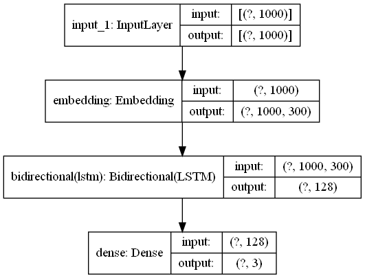

### Experiment
---

### Python Files
- **run_ML.py**: This files contains the python code to run traditional ML models.
- **run_RNN.py**: This files contains the python code to run the RNN model.
### Library
- TensorFlow Keras
### RNN model 

##### RNN-GRU architecture

Figure 1: RNN-GRU

##### RNN-Bidirectional LSTM architecture

Figure 2: RNN-BiLSTM

##### Some important details:
- Single Layered RNN-GRU and Bidirectional RNN-LSTM is are the two models that would eventually converge to produce a decent accuracy. However, the other two models – Multi-layered RNN-GRU and Single layered LSTM cannot converge.
- The training/testing observation showed that if the loss for each iteration becomes below 1.0, the model would be quickly converged in the next 2-3 epochs.
- The single layered RNN-GRU is the encoder model of RNN-Encoder Decoder. 
- Word Embedding dimensions: 300
- Hidden States dimensions: 64, 128 (bidirectional RNN-LSTM)
- Max sequence length: 1000 (padded with 0) 

##### Results
|Models	|Training	|Testing|
| ----------- | ----------- | -----------|
|Single Layered RNN-GRU (encoder)	|0.9628888905048371	|0.9414999961853028|
|Bidirectional RNN-LSTM	|0.9951481461524964|	0.9171666741371155|

##### Some resources:
- How to implement Seq2Seq LSTM Model in Keras: https://towardsdatascience.com/how-to-implement-seq2seq-lstm-model-in-keras-shortcutnlp-6f355f3e5639
- Difference Between Return Sequences and Return States for LSTMs in Keras: https://machinelearningmastery.com/return-sequences-and-return-states-for-lstms-in-keras/
- Sequence Classification with LSTM Recurrent Neural Networks in Python with Keras: https://machinelearningmastery.com/sequence-classification-lstm-recurrent-neural-networks-python-keras/
- A ten-minute introduction to sequence-to-sequence learning in Keras: https://blog.keras.io/a-ten-minute-introduction-to-sequence-to-sequence-learning-in-keras.html
- Understanding Tensorflow's tensors shape: static and dynamic: https://pgaleone.eu/tensorflow/2018/07/28/understanding-tensorflow-tensors-shape-static-dynamic/
