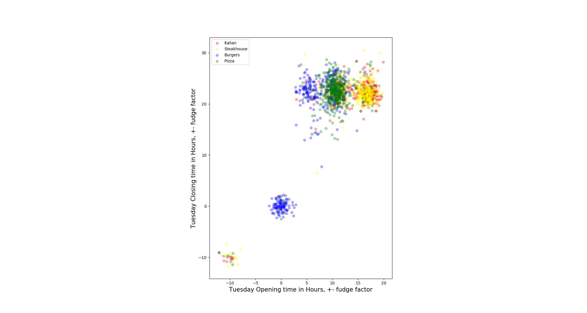
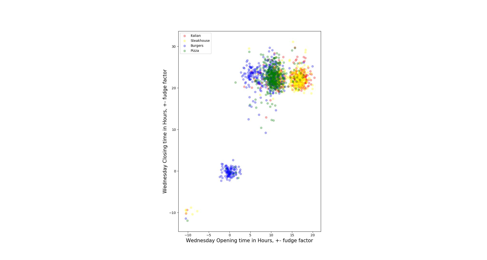
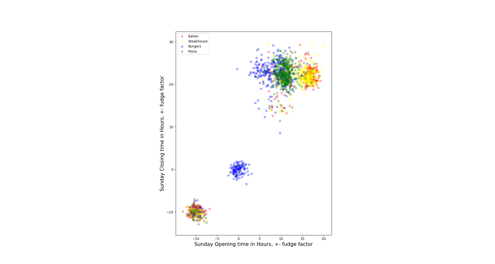
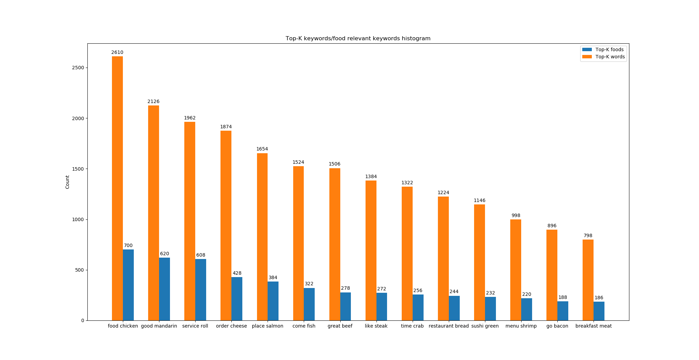

**Table of Contents**
[toc]
---

### Python Files
- **hours.py**: This files contains the python code to extract feature 'hours'.


### 0. Dataset preview
X_regular:

```
                                               hours 
0  {'Tuesday': '11:0-22:0', 'Wednesday': '11:0-22... 
1  {'Monday': '9:0-0:0', 'Tuesday': '9:0-0:0', 'W...  
2  {'Monday': '10:30-21:0', 'Tuesday': '10:30-21:... 
3  {'Tuesday': '10:0-17:0', 'Wednesday': '10:0-17... 
4  {'Monday': '11:0-21:0', 'Tuesday': '11:0-21:0'...  
5  {'Monday': '11:0-20:0', 'Tuesday': '11:0-21:0'...  
6  {'Monday': '17:0-23:0', 'Tuesday': '17:0-23:0'... 
7  {'Monday': '0:0-0:0', 'Tuesday': '17:0-22:0', ... 
8  {'Monday': '7:0-22:0', 'Tuesday': '7:0-22:0', ...
9  {'Monday': '6:0-6:0', 'Tuesday': '6:0-6:0', 'W... 

n_samples: 6000
```

y:
```
[0 1 1 0 1 0 0 2 1 2]

n_targets: 6000
```

### Attention: The part 1 results are conducted under a different experiement, the goals are changed. Therefore, the results cannot be compared with other documents.
### 1. Feature Extraction
We perform two steps operations to conduct Feature Extraction: Feature Creation and Feature Selection.
##### 1.1 Feature Creation

The dataset we have looks like this:
```
   Unnamed: 0                                              hours   categories             business_id
0           0  {'Monday': '10:0-3:0', 'Tuesday': '10:0-3:0', ...      Burgers  tLpkSwdtqqoXwU0JAGnApw
1           1  {'Monday': '0:0-0:0', 'Tuesday': '11:0-21:0', ...        Pizza  ZkzutF0P_u0C0yTulwaHkA
2           2  {'Monday': '11:0-21:0', 'Tuesday': '11:0-21:0'...        Pizza  0y6alZmSLnPzmG5_kP5Quw
3           3  {'Monday': '11:0-22:0', 'Tuesday': '11:0-22:0'...        Pizza  Yr_w9lakJrKMyEG_hI6zbA
4           4  {'Monday': '11:0-22:0', 'Tuesday': '11:0-22:0'...      Burgers  Yr_w9lakJrKMyEG_hI6zbA
5           5  {'Monday': '11:30-0:0', 'Tuesday': '11:30-0:0'...  Steakhouses  cicPsia8Wj-DNRkmLbD_xg
6           6  {'Monday': '11:0-20:0', 'Tuesday': '11:0-20:0'...        Pizza  YHWjW9GLcuNtnh_xdCSOeA
7           7  {'Monday': '6:0-21:0', 'Tuesday': '6:0-21:0', ...      Burgers  GDf1SI_SnW93_lJN__egrQ
8           8  {'Monday': '6:0-23:0', 'Tuesday': '6:0-23:0', ...      Burgers  CfwrsG76Wm4iLS22v_wAcg
9           9  {'Monday': '10:0-2:0', 'Tuesday': '10:0-2:0', ...      Burgers  grZ6FnfZoj1pQWElAQve3g
```
For non-textual features, in this case 'hours', we need to break it into numerical values to make it sense for the training/testing process.

```
    categories    m1    m2    t1    t2    w1    w2   th1   th2    f1    f2    s1    s2   su1   su2
0      Burgers  10.0  27.0  10.0  27.0  10.0  27.0  10.0  27.0  10.0  27.0  10.0  27.0  10.0  27.0
1        Pizza   0.0   0.0  11.0  21.0  11.0  21.0  11.0  21.0  11.0  22.0  11.0  22.0  11.0  20.0
2        Pizza  11.0  21.0  11.0  21.0  11.0  21.0  11.0  22.0  11.0  22.0  11.0  22.0  11.0  21.0
3        Pizza  11.0  22.0  11.0  22.0  11.0  22.0  11.0  22.0  11.0  22.0  11.0  22.0  11.0  22.0
4      Burgers  11.0  22.0  11.0  22.0  11.0  22.0  11.0  22.0  11.0  22.0  11.0  22.0  11.0  22.0
5  Steakhouses  11.3  24.0  11.3  24.0  11.3  24.0  11.3  24.0  11.3  25.0  16.0  25.0  16.0  23.0
6        Pizza  11.0  20.0  11.0  20.0  11.0  20.0  11.0  20.0  11.0  21.0  11.0  21.0  11.0  19.0
7      Burgers   6.0  21.0   6.0  21.0   6.0  21.0   6.0  21.0   6.0  22.0   6.0  22.0   6.0  21.0
8      Burgers   6.0  23.0   6.0  23.0   6.0  23.0   6.0  23.0   6.0  23.0   6.0  23.0   6.0  23.0
9      Burgers  10.0  26.0  10.0  26.0  10.0  26.0  10.0  26.0  10.0  26.0  10.0  26.0  10.0  26.0
```

As it is similarly processed from the last experiment, we transformed the json format hours into 14 independent features represents the opening and closing hours on weekdays for each restaurant. (Unit: hours)
**We reasonably keep all features for now, since we assume even one independent time could be a significant feature that helps for the classification.**

To test our assumption, we pair opening hours and closing hours for each day to plot the scatter to check the distribution of the restaurants.
- Not all restaurants open on all days within a week, we define these restaurants as **outliers** when the days they are not open. To solve such N/A value issue, we replace the null values by **negative values**, so that is how the restaurants in left-down corner come from. 
- We also add some 'fudge factor' on the distribution scatter since if we do not do that, points are **overlapped with each other** which gets hard to tell the **density** of distribution. The noise we add is Gaussian Distributed in the range of 0 to 1 inclusive (Unit: hour). 
- There are some restaurants open 24 hours 7 days a week, so they mark their opening hours and closing hours for that day as **'0:00' - '0:00'**, this explains there is also a cluster of points that are around the origins of the coordinates. (e.g. [Steakhouse: East Ridge Diner & Steakhouse](https://www.yelp.com/biz/east-ridge-diner-and-steakhouse-rochester))








After **visually observation**, we found for most restaurants, the closing hours are hard to tell the classes of different restaurants(mapped to y-coordinate), but the opening hours do, though there are many restaurants overlapped around 10 AM. One interesting phenomenon is it seems there are some Italian and Steakhouse restaurants that does not open on Monday and Sunday. However, we need to statistically test the relation later.


Base on our observation, we created other attributes to explain the phenomenon:
- is24hoursAny(Binary feature that checks if the restaurant ever has one day that running 24 hours) 
- isMondayOpen(Binary feature that checks if the restaurant ever open on Monday)
- isSundayOpen(Binary feature that checks if the restaurant ever open on Sunday)
- weeklyBusinessHoursTotal(Total running hours of the entire week)
- weeklyBusinessDaysTotal(Total running days of the entire week)
- weeklyBusinessHoursAverage(Average hours running per day)

We label our 4 categories of restaurants as 1 from 'Italian' and 'Steakhouse', 0 from 'Burgers' and 'Pizza'.
We calculate the Pearson Correlation Coefficient between each feature with targets values

```
[(0.07407551311437341, 'm1'), 
(-0.11731578824302691, 'm2'), 
(0.4950215768112705, 't1'), 
(0.16077867219458727, 't2'), 
(0.5864094264798979, 'w1'), 
(0.21039753765592104, 'w2'), 
(0.6008755867323026, 'th1'), 
(0.22602446026919382, 'th2'), 
(0.6060301041747369, 'f1'), 
(0.2161271409426079, 'f2'), 
(0.6410376507620771, 's1'), 
(0.23164634299100906, 's2'), 
(0.08686741536964375, 'su1'), 
(-0.11269885908039662, 'su2'), 
(-0.13524901840982256, 'is24hoursAny'), 
(0.24307624944474643, 'isMondayOpen'), 
(0.23307751762726242, 'isSundayOpen'), 
(-0.5879066836052446, 'weeklyBusinessHoursTotal'),
(-0.27385921252217005, 'weeklyBusinessDaysTotal'), 
(-0.3730318736301774, 'weeklyBusinessHoursAverage')]
```

We found that the opening hours each day within a week have a strong connection with the classes. The 'weeklyBusinessHoursTotal' is also considered as a valuable feature.

We also produce the cross-correlation matrix to check the redundancy for each feature pairs.

It is interesting to find that 'Friday closing hours' is strongly relevant to 'Saturday closing hours'(0.90). In actual scenes, we may assume Friday and Saturday are the real weekends for restaurant services. It is not surprising to find that the correlation coefficient from Monday and Sunday to any day else is weak. We may assume that these two days are normally the days that restaurants reducing their working hours or even shut down.


### Appendix: Food relavant keywords
#### A1. List most common words using CountVecterizer
To calculate the frequency for each word from the corpus, we need to employ the CountVectorizer from Scikit-learn to produce the matrix. We set the max feature numbers to 200 since the number of food-relevant keywords is much less than 200. IF the keywords numbers are expected to be large-sized, the feature numbers should be at least 10 times bigger than it. In this case, we expect 20 food-relevant keywords to extract.

Each feature represent an word frequency. We need to sum up each feature's frequency.
```py {.line-numbers}
from sklearn.feature_extraction.text import CountVectorizer

cv=CountVectorizer(max_features = 200) 
word_count_vector=cv.fit_transform(df)
print(word_count_vector.todense())

sum_words = word_count_vector.sum(axis=0) # numpy matrix (not recommend to use this class)
print(sum_words)
```
```
[[ 0  0  0 ...  0  0  0]
 [ 0  0  0 ...  0  0  0]
 [ 0  0  0 ...  0  0  0]
 ...
 [ 0 10  0 ...  0  0  0]
 [ 0  0  0 ...  0  0  0]
 [ 4 64  0 ...  0  0  0]]

[[ 4 98  2 ...  2 10  2]]
```
We list out the vocabulary items in the countvectorizer which are stored in Python dictionary data structure and sorted the words in pairs in the tuple, where the first element represent the word itself and the second represent the word frequency from all corpus.
```py {.line-numbers}
words_freq = [(word, sum_words[0, idx]) for word, idx in cv.vocabulary_.items()]
words_freq =sorted(words_freq, key = lambda x: x[1], reverse=True)
print(words_freq)
```

In example below, 'food' was spotted 2610 times which makes it the most common word. Other words like '**good**', '**service**' and '**order**' showed up **2126**, **1962** and **1874** times in all corpus.
```
[('food', 2610), ('good', 2126), ('service', 1962), ('order', 1874), ('place', 1654), ('come', 1524), ('great', 1506), ('like', 1384), ('time', 1322), ('restaurant', 1224), ('sushi', 1146), ('menu', 998), ('go', 896), ('breakfast', 798), ('price', 782), ('nice', 780), ('dish', 746), ('chicken', 700), ('mozen', 692), ('delicious', 690), ('fresh', 680), ('vegas', 676), ('best', 664), ('dinner', 636), ('brunch', 636), ('mandarin', 620), ('fry', 618), ('table', 618), ('roll', 608), ('love', 598), ('want', 578), ('taste', 576), ('look', 568), ('salad', 550), ('think', 546), ('amaze', 544), ('experience', 532), ('staff', 530), ('lunch', 522), ('wait', 512), ('meal', 508), ('definitely', 498), ('star', 494), ('little', 488), ('sauce', 478), ('better', 474), ('take', 472), ('hotel', 
470), ('drink', 468), ('pretty', 466), ('server', 464), ('excellent', 456), ('oriental', 454), ('burger', 444), ('friendly', 444), ('enjoy', 444), ('bento', 444), ('cheese', 428), ('buffet', 414), ('serve', 408), ('try', 408), ('ask', 402), ('flavor', 386), ('say', 384), ('recommend', 384), ('salmon', 384), ('know', 382), ('small', 380), ('soup', 380), ('quality', 368), ('expect', 364), ('review', 356), ('offer', 354), ('curry', 354), ('tell', 352), ('wasn', 350), ('give', 346), ('indian', 346), ('overall', 336), ('asian', 336), ('visit', 330), ('din', 326), ('need', 324), ('fish', 322), ('minutes', 316), ('leave', 316), ('disappoint', 310), ('dessert', 310), ('seat', 306), ('sure', 304), ('waitress', 304), ('tasty', 302), ('worth', 302), ('portion', 298), ('night', 298), ('room', 294), ('check', 288), ('eat', 284), ('stay', 282), ('people', 280), ('rice', 280), ('beef', 278), ('location', 278), ('right', 276), ('strip', 274), ('steak', 272), ('view', 270), ('fruit', 266), ('decide', 262), ('special', 260), ('feel', 256), ('start', 
256), ('crab', 256), ('cook', 254), ('chef', 254), ('egg', 254), ('work', 252), ('sashimi', 250), ('area', 248), ('high', 248), ('spicy', 246), ('perfect', 246), ('bread', 244), ('attentive', 242), ('different', 242), ('grill', 238), ('green', 232), ('japanese', 232), ('friends', 230), ('bring', 224), ('highly', 224), ('thai', 224), ('get', 222), ('awesome', 222), ('arrive', 222), ('walk', 222), ('husband', 220), ('atmosphere', 220), ('shrimp', 220), ('waiter', 220), ('entree', 220), ('long', 216), ('water', 216), ('bistro', 216), ('friend', 214), ('floor', 214), ('items', 212), ('favorite', 210), ('sunday', 210), ('super', 206), ('options', 206), ('sandwich', 204), ('sweet', 204), ('selection', 204), ('decent', 202), ('coffee', 200), ('bite', 198), ('thing', 196), ('probably', 192), ('away', 192), ('manager', 192),
```
#### A2. Apply NLTK wordnet synset to extract food-relevant words
**WordNet** is the lexical database i.e. dictionary for the English language, specifically designed for natural language processing.

**Synset** is a special kind of a simple interface that is present in NLTK to look up words in WordNet. Synset instances are the groupings of synonymous words that express the same concept. Some of the words have only one Synset and some have several.

**Hyponym:** Both come to picture as Synsets are organized in a structure similar to that of an inheritance tree. This tree can be traced all the way up to a root hypernym. Hypernyms provide a way to categorize and group words based on their similarity to each other.

It is not enough to find the most common words in all ranges, extraction has to be narrowed down to food-relevant. In this case, we employ NLTK package wordnet synset to group all hyponyms that relates to 'food'.

```py {.line-numbers}
from nltk.corpus import wordnet as wn
nltk.download('wordnet')

food = wn.synset('food.n.02')
print(type(food))
food_list = list(set([w for s in food.closure(lambda s:s.hyponyms()) for w in s.lemma_names()]))
food_list2 = [w.replace('_', ' ') for s in food.closure(lambda s:s.hyponyms()) for w in s.lemma_names()]
print(food_list2)
print(len(words_freq))
```
'**food.n.02**' indicates the **2nd** deifnition of '**food**' as a **noun**.
Of all **hyponyms** of '**food**' as a **closure**, we extract their **lemma names** and group them as a list.
```
['baked goods', 'breakfast food', 'butter', 'cheese', 'chocolate', 'coconut', 'coconut meat', 'convenience food', 'dika bread', 
'fish', 'fresh food', 'fresh foods', 'health food', 'junk food', 'leftovers', 'loaf', 'meat', 'pasta', 'alimentary paste', 
'produce', 'green goods', 'green groceries', 'garden truck', 'seafood', 'slop', 'yogurt', 'yoghurt', 'yoghourt', 'bread', 
'breadstuff', 'staff of life', 'cake', 'pastry', 'cereal', 'muesli', 'brown butter', 'beurre noisette', 'clarified butter', 
...]
```
We looped over all features in food hyponyms to retain all food-relevant keywords and sorted all pairs in descending order.
```py {.line-numbers}
words_food_relevant = [(food, pair[1]) for pair in words_freq for food in food_list2 if pair[1] > 30 and pair[0] == food]
print(words_food_relevant)
print(len(words_food_relevant))
```
```
[('chicken', 700), ('mandarin', 620), ('roll', 608), ('cheese', 428), ('salmon', 384), ('fish', 322), ('beef', 278), 
('steak', 272), ('crab', 256), ('bread', 244), ('green', 232), ('shrimp', 220), ('bacon', 188), ('meat', 186), 
('tuna', 180), ('cake', 170), ('pork', 164), ('oyster', 160), ('mushroom', 140), ('toast', 140), ('tomato', 134), 
('scallop', 134), ('butter', 130), ('pasta', 122), ('seafood', 122), ('plate', 118), ('calamari', 116), ('pepper', 112), 
('naan', 112), ('chocolate', 96), ('roast', 96), ('waffle', 96), ('lettuce', 94), ('lamb', 88), ('noodle', 88), 
('game', 84), ('avocado', 82), ('potato', 76), ('spinach', 74), ('date', 72), ('bean', 70), ('mango', 70), ('stick', 66), ('turkey', 66), ('onion', 60), ('sausage', 60), ('yogurt', 60), ('veggie', 58), ('chili', 56), ('truffle', 56), 
('mustard', 50), ('side', 50), ('banana', 50), ('dumplings', 50), ('gnocchi', 50), ('apple', 48), ('prawn', 48), 
('lychee', 48), ('grouper', 48), ('vegetable', 46), ('joint', 46), ('cucumber', 46), ('chop', 44), ('orange', 42), 
('pumpkin', 42), ('duck', 42), ('polenta', 42), ('lemon', 38), ('wonton', 38), ('gorgonzola', 38), ('buffalo', 36), 
('muffin', 34), ('chipotle', 34), ('watermelon', 32)]
74
```




#### A3. The Top-K food keywords discovery
While the tasks are restaurants targetted classification, it is reasonable to try extracting the food-related keywords from the given text corpus to further decrease the feature dimensions. Previously, from the week4 experiment, it was successful to extract the food-relevant keywords by using NLTK wordnet dictionary, this time it is worth employing the same approach to experiment.

```
[
    ['shrimp'], ['chicken', 'chicken', 'round'], 
    [], 
    ['green', 'cheese', 'rib', 'chicken', 'strawberry', 'potato'], 
    ['roll'], 
    ['seafood', 'chicken', 'shrimp', 'shrimp', 'butter'], 
    ['tortilla', 'steak', 'steak', 'pepper'], 
    [], 
    [], 
    ['heart', 'heart'], 
    [], 
    ['chipotle', 'chipotle', 'veggie', 'green'], 
    ['pita'], 
    ['rib', 'salmon'],
    ...
    ]
```
The results show the transformed cut words list after the selection, where each member list represents a user review filtered by the vocabulary. The empty list can be commonly seen due to its original reviews contains no food relevant keywords. Due to the small size of the samples and imbalanced nature may hugely affect the performance, for those empty list we assign them zeros in the same length of W2V feature numbers.

It is in nature just select more important keywords than extracting all words, so the performance however is worse than just extracting the regular reviews. 
```
W2V + LR params:

sg = 1
size=300
iter=30
{'penalty': ['l1'], 'solver': ['liblinear']},
{'penalty': ['l2'], 'solver': ['liblinear','newton-cg', 'lbfgs', 'sag']},
```

```
F1 scores:

l1 + liblinear: 0.541781294
l2 + liblinear: 0.542167673
l2 + newton-cg: 0.543132704
l2 + lbfgs: 0.543132704
l2 + sag: 0.543132704
```

### Resources
- [Kaggle: Exploring yelp reviews dataset](https://www.kaggle.com/vksbhandary/exploring-yelp-reviews-dataset#Lets-find-relationship-between-users's-friends-and-review-patterns)
- [Baidu: Yelp 情感分析](https://github.com/duoergun0729/nlp/blob/master/%E9%A2%84%E6%B5%8BYelp%E7%BE%8E%E9%A3%9F%E8%AF%84%E5%88%86.md)
- [Medium: How to list the most common words from text corpus using Scikit-Learn?](https://medium.com/@cristhianboujon/how-to-list-the-most-common-words-from-text-corpus-using-scikit-learn-dad4d0cab41d)
- [StackOverflow: NLTK food corpus extraction](https://stackoverflow.com/questions/19626737/where-can-i-find-a-text-list-or-library-that-contains-a-list-of-common-foods)