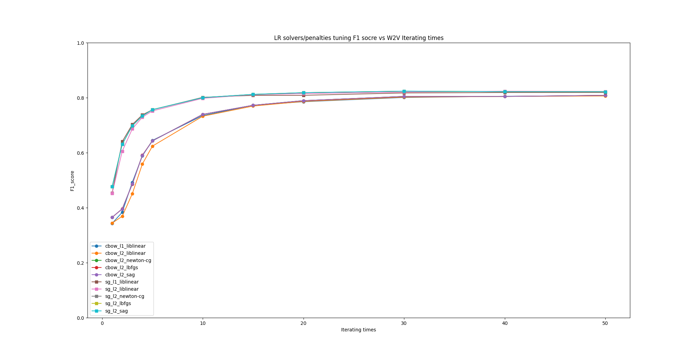
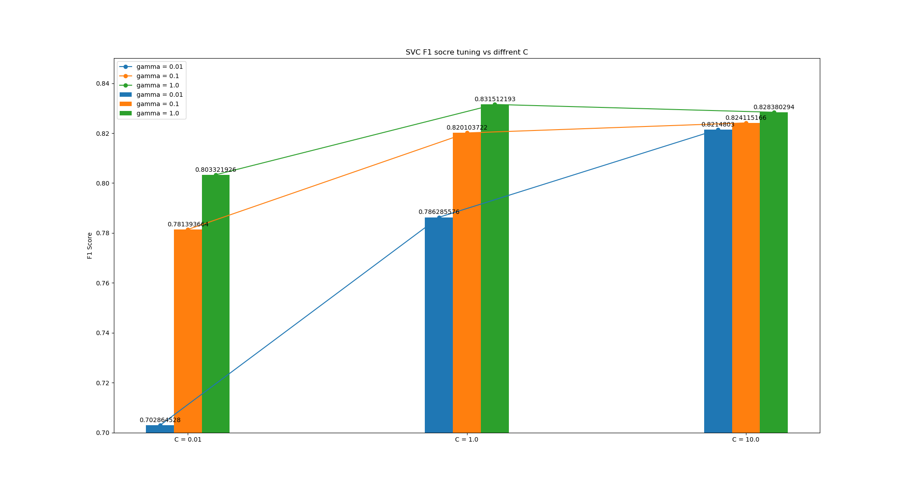
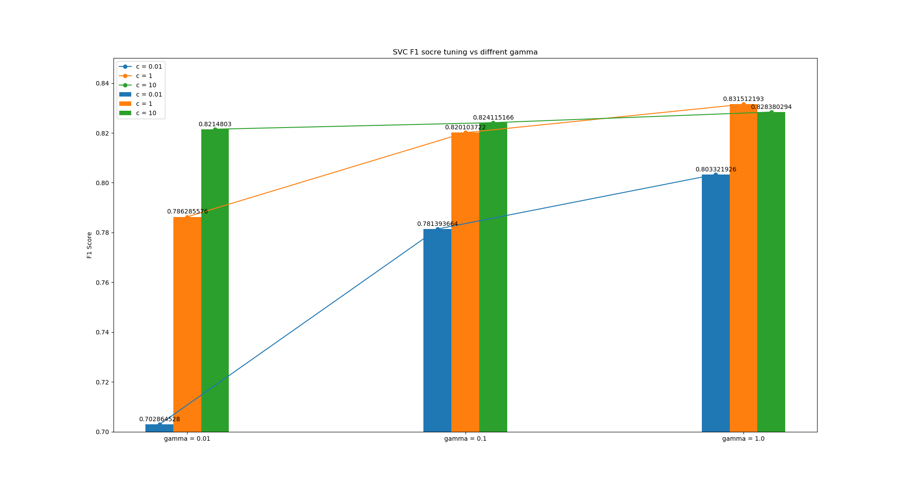
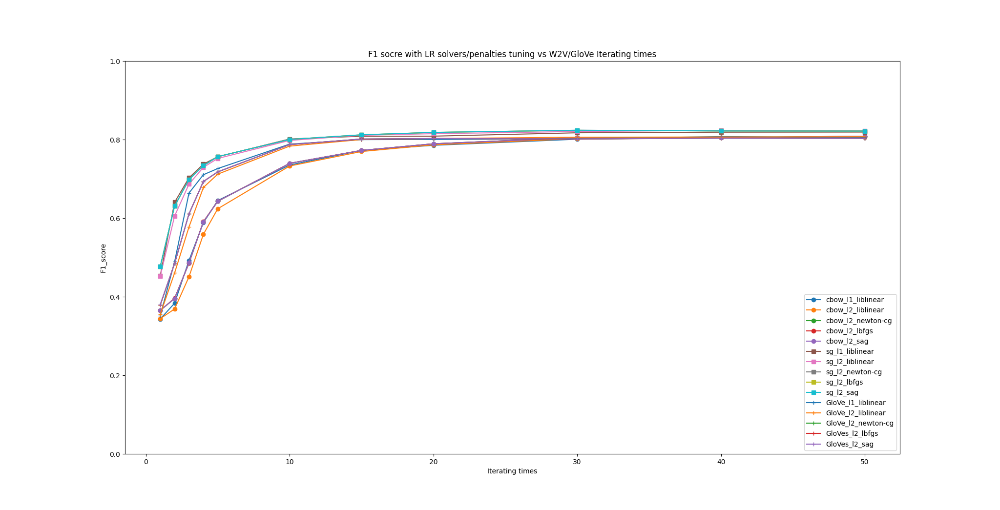
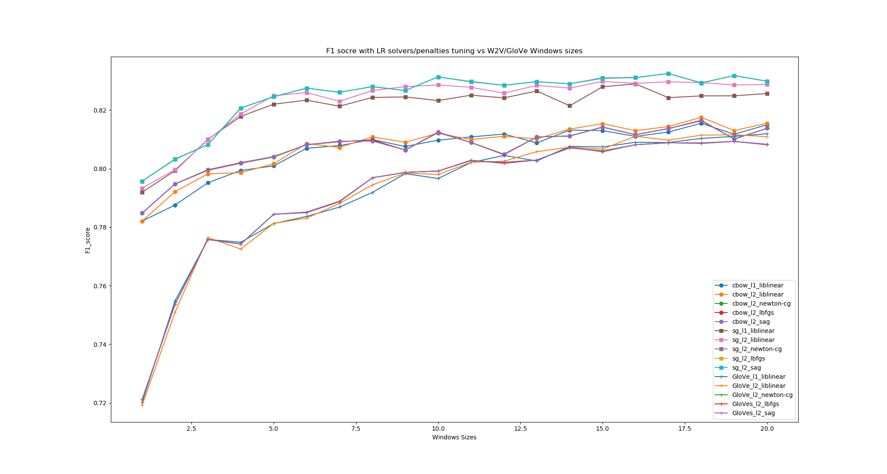
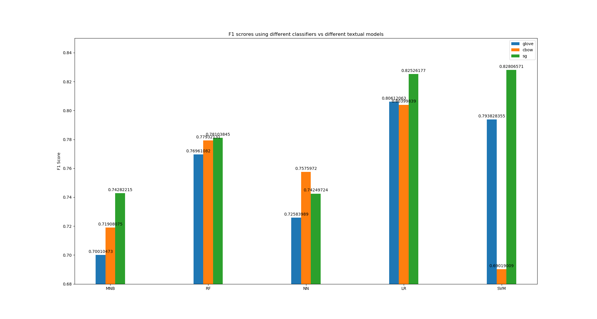

### Textual Features
---


### 1. Tuning Parameters for W2V model and Logistic Regression model

Since the tasks are classification related hence the carefully selected classifiers play important roles. Based on the embedded words vectors from the W2V model, where the VxN weights matrix contains all vocabulary vectors where it linearly spans in a fixed(smaller than vocabulary total length) number of dimensions space. Here it introduces two different classifiers for the tuning works.

##### 1.1. F1 Score comparison under different w2v models and sizes, LR solvers and penalties

**w2v models**: Continuous-bag-of-words (CBOW) and Skip-grams (SG)
**w2v sizes**: The number of dimensions (N) of the N-dimensional space that gensim Word2Vec maps the words onto.
**LR solvers**: The algorithms to optimize the loss function.
**LR penalty**: To specify the norm used in the penalization (regularization).

**W2V Params options:**

The tuning process try fitting the model in SG and CBOW, under each version model, it fits the models infeature numbers in 12 options. 2 * 12 = 24 W2V rounds fitting.
```py {.line-numbers}
# W2V params options
    for sg in [0, 1]:
        for size in [10,20,30,40,50,100,150,200,250,300,400,500]:
            word2vec_model = Word2Vec(cutWords_list, sg = sg, size=size, iter=30, min_count=5,
                                        workers=multiprocessing.cpu_count())
```
The tuning process would try l1 norm and liblinear first, and switch to l2 norm with 4 other penalties:
liblinear, newton-cg, lbfgs and sag. (1 + 4) = 5 model training and testing for each W2V round.

```
LR params options:

{'penalty': ['l1'], 'solver': ['liblinear']},
{'penalty': ['l2'], 'solver': ['liblinear','newton-cg', 'lbfgs', 'sag']}

```
The newton-cg, lbfgs and sag optimization algorithms require loss function being able to calculate first and second continuous derivative, hence L1-norm (manhattan distance) should not employ them. However, liblinear works fine in both L1-norm and L2-norm. The LR works fine for multiclass classification, but only in One-vs-Rest(OvR) for liblinear, which works worse than many-va-many(MvM) strategy in theories.
In total, the overall task tuning times are 24 * 5 = 120 times.


**W2V model analysis:**
SG overall performs better than CBOW from the beginning to end, where it has around 3 percent differences of F1 score, which is considered to be high contrast since the average F1 increase in variant W2V sizes are relatively small. Based on the images, the W2V models in the first 6 sizes (particularly 10, 20, 30, 40, 50, 100), the increase rate of F1 is high, the trend shows the promising upwards direction almost get vertical, after size becoming 100, the upward trends mitigate and gets more flattened. This is because the model fits convergence in which more features would not hugely benefit the classification and rather to intensify the machine resources. 
The recommend params are SG and size between 200 to 400 whereas the W2V models has 3356 vocabulary and 6000 samples numbers.

**LR model analysis:**
As previously mentioned, the liblinear algorithm works fine for multiclass classification but only in OvR strategy, therefore when performing multiclass LR, the F1 is smaller than other algorithms. The curve proves it that either by using SG or CBOW, the lines in colors blue, orange, brown, and pink always are less performative than other lines of algorithms. The results given by the other three algorithms show the lines are overlapped with each other. This is because the F1 score is too close (in 0.01% - 0.001% granularity) therefore the Matplotlib could not show the difference (It can be solved by plotting the logarithmic version of F1 comparison). This means at least for this experiment cases, the algorithms newton-cg, lbfgs and sag work well.


##### 1.2. F1 Score comparison under different w2v Iteration time, LR solvers, and penalties
The iteration times decide how much the W2V is well trained in rounds just by comprehend words' meanings. The tuning process takes different values of iteration parameters to check how this affects the final performance.
```py {.line-numbers}
# W2V params options

for sg in [0, 1]:
    for iters in [1,2,3,4,5,10,15,20,30,40,50]:
        word2vec_model = Word2Vec(cutWords_list, sg = sg, size=300,iter=iters, min_count=5, workers=multiprocessing.cpu_count())
```
**Attention**: The feature size is set to be 300, which comes from the previous test that 300 is considered to be a good candidate to produce high F1 in the end.


**W2V model Iteration time analysis:**
Same as previous experiments illustrated, SG has better performance than CBOW in the case dealing with a small number of samples, hence the images tell in the overall perspective, SG always performs better. The curves are sigmoid-like that in the range of 1 to 10 iteration times, the trend is exponential whereas each more iteration times gives a huge performance increase. It however converges to once the iteration times gets to 20 above, which makes sense that the embedding model is tuned to be the most fitted to the current samples.

---
### 2. Tuning Parameters for SVC model

##### 2.1. F1 Score comparison under different w2v models and sizes, LR solvers and penalties
**RBF** kernel function is used for tuning the SVC classifier. It has two essential parameters that determine the final performance. The SVC costs usually much more time than other classifiers when training/testing, but will be quick for prediction on validation datasets.

**SVC C**: The regularization parameter. The strength of the regularization is inversely proportional to C. This is a relaxation coefficient to balance the relationship between the complex of support vectors and the mis-classification rate. 
**SVC gamma**: This is a hyper-parameter that is commonly set to be 1/# features. This parameter defines how much a single sample can affect the hyper-plane.
```
SVC params options

param_grid = [
{'estimator__kernel': ['rbf'], "estimator__C":[0.1, 1.0, 10], "estimator__gamma":[1.0, 0.1, 0.01, 0.03]}
]
``` 
The tuning process will run 3 * 4 = 12 times for each param pair try.

The images show that as the values of C gets bigger, the F1 increases. The trends apply to all combinations of gamma values. This is because as C gets larger, the loss function becomes more tolerant to those points in further space thus treat them as support vectors. However, it makes the hyper-planes become more complex which may cause the model to suffers overfitting issues. As C gets small, fewer samples would become the support vectors thus the model gets simpler.


The trends for F1 scores under different gamma values look similar to what it is showed from VS C's. When gamma is small, the single sample has less impact on the hyper-plane therefore be less possible to be selected as support vectors. By the way, it is interesting to see the gamma differences particularly impacts more on the small C's model. This phenomenon tells that as C gets large, the influence of gamma becomes least.


---
##### 2.2. Comparison between LR and SVC
W2V & LR:
- size = 400
- iter = 30
- sg = SG
- penalty = 'l2'
- solver = 'sag'

F1: **0.82721686**

W2V & SVC:
- size = 400
- iter = 30
- sg = SG
- C = 1.0
- gamma = 1.0

F1: **0.83151219**

It is hard to say Using SVC is better than LR, since the difference of F1 scores is not significant, only 0.43% around. In the perspective of fitting time for their two, SVC spent 4 times of time than what is costed by LR. Each classifier employs multiclass classification strategies to deal with the experiment case.


### 3. Tuning Parameters for GloVe model and Logistic Regression model

Since the tasks are classification related hence the carefully selected classifiers play important roles. Based on the embedded words vectors from the GloVe model, where the VxN weights matrix contains all vocabulary vectors where it linearly spans in a fixed(smaller than vocabulary total length) number of dimensions space. Here it introduces two different classifiers for the tuning works.

##### 3.1. F1 Score comparison under different w2v/GloVe models and sizes, LR solvers and penalties

**w2v models**: Continuous-bag-of-words (CBOW) and Skip-grams (SG)
**w2v sizes**: The number of dimensions (N) of the N-dimensional space that gensim Word2Vec maps the words onto.
**LR solvers**: The algorithms to optimize the loss function.
**LR penalty**: To specify the norm used in the penalization (regularization).

**W2V Params options:**

The tuning process try fitting the model in SG and CBOW, under each version model, it fits the models infeature numbers in 12 options. 2 * 12 = 24 W2V rounds fitting.
```py {.line-numbers}
# W2V params options
    for sg in [0, 1]:
        for size in [10,20,30,40,50,100,150,200,250,300,400]:
            word2vec_model = Word2Vec(cutWords_list, sg = sg, size=size, iter=30, min_count=5,
                                        workers=multiprocessing.cpu_count())
```
The tuning process would try l1 norm and liblinear first, and switch to l2 norm with 4 other penalties:
liblinear, newton-cg, lbfgs and sag. (1 + 4) = 5 model training and testing for each W2V round.

```
LR params options:

{'penalty': ['l1'], 'solver': ['liblinear']},
{'penalty': ['l2'], 'solver': ['liblinear','newton-cg', 'lbfgs', 'sag']}

```
The newton-cg, lbfgs and sag optimization algorithms require loss function being able to calculate first and second continuous derivative, hence L1-norm (manhattan distance) should not employ them. However, liblinear works fine in both L1-norm and L2-norm. The LR works fine for multiclass classification, but only in One-vs-Rest(OvR) for liblinear, which works worse than many-va-many(MvM) strategy in theories.
In total, the overall task tuning times are 24 * 5 = 120 times.


**GloVe model size analysis:**
The size of the word vectors shows a general similar upwards trend comparing with SG and CBOW. However, the f1 scores soar at the very beginning when the word vectors size is below 100, the increasing rate is higher than SG and CBOW, but since the starting f1 score is lower than both, the GloVe model ends up being in the middle performance before CBOW eventually exceeds it. The overall performance shows that SG is still out-performed than CBOW and GloVe, whereas the differences between CBOW and GloVe are not significant. 

 

##### 3.2. F1 Score comparison under different w2v/GloVe Iteration time
The iteration times decide how much the W2V/GloVe is well trained in rounds just by comprehend words' meanings. The tuning process takes different values of iteration parameters to check how this affects the final performance.
```py {.line-numbers}
# W2V params options

for sg in [0, 1]:
    for iters in [1,2,3,4,5,10,15,20,30,40,50]:
        word2vec_model = Word2Vec(cutWords_list, sg = sg, size=300,iter=iters, min_count=5, workers=multiprocessing.cpu_count())
```
**Attention**: The feature size is set to be 300, which comes from the previous test that 300 is considered to be a good candidate to produce high F1 in the end.


**GloVe model Iteration time analysis:**
Same as previous experiments illustrated, SG has better performance than CBOW and GloVe in all cases. GloVe also plays in the middle role between SG and CBOW, but in this case (comparing iteration times), GloVe has almost the same score increasing rate. Interesting thing is, when the iteration is low, the GloVe performs close to SG, whereas when iteration time gets larger (greater or equal to 20), the GloVe is beaten by SG and close to the CBOW. In the end, CBOW and GloVe have emerged into similar performances.

##### 3.3. F1 Score comparison under different w2v/GloVe Window size
```py
    windows = [1,2,3,4,5,6,7,8,9,10,11,12,13,14,15,16,17,18,19,20]
        for window in windows:
            ...
```


**GloVe model Window size analysis:**
The window size also decides all three models' performances. As can be seen from the figure, the very model that has most influenced by the window size is GloVe, since GloVe is highly dependent on the co-occurrence matrix statistically extracted from the corpora. If the size of the window is small, the loss function would suffer the heavier than SG and CBOW. The best window size in our case is around 17, which means there would be 17 up ahead and down below (in total 34) neighboring words would be counted when producing the co-occurrence matrix.

---
### 4. Comparison W2V/GloVe Results under different classifiers



We employed five classifiers based on different classification methodologies and best-tuned parameters to conduct the experiments on the exact same features and target values. The results showed the MNB produced the least results and LR out-performed among all. The highest score that gets from the records is 0.82806571 from SVM-SG, and the lowest score came from the same classifiers which are 0.69019009 from SVM-CBOW. This shows the high contrast of performances using SVM model. The highest average f1 score came from LR, whereas LR-GloVe, LR-SG, and LR-CBOW are all exceeded 0.80. The other two classifiers performed close - the scores range from 0.70 to 0.75. When it comes to the comparison among the textual models, SG wined over all others which proved it to be the best-performed choice of textual model. CBOW should be the second place but in some cases (SVM or LR), GloVe is better. In terms of the classifiers' ability of model tolerance, RF produces the most averaged results and LR is similar.


### Appendix

##### A1. Tuning technique: Scikit-learn GridSearch
GaridSearchCV is a convenient tool for the usage of tuning the parameters under different models. The way to use it shows below:
```py {.line-numbers}
from sklearn.model_selection import GridSearchCV

param_grid = [
{'n_estimators': [3, 10, 30], 'max_features': [2, 4, 6, 8]},
{'bootstrap': [False], 'n_estimators': [3, 10], 'max_features': [2, 3, 4]},
]

forest_reg = RandomForestRegressor()
grid_search = GridSearchCV(forest_reg, param_grid, cv=5,
                          scoring='neg_mean_squared_error')
 
grid_search.fit(housing_prepared, housing_labels)
```
The parameters grid contains a different set of parameter options. Every dictionary represents one possible set of parameters, it is different than the item pairs inside of it since each inside pairs can be using to perform one type of tuning process while the outer dictionary can be used to set for separate goals. (The parameters for different classifiers are designed differently sometimes)

For different inner classifers like (where classifiers are wrapped by an outer package):
```py
    param_grid = [
        {'estimator__kernel': ['rbf'], "estimator__C":[10], "estimator__gamma":[1.0]}
        ]
    clf = OneVsOneClassifier(SVC())
    grid_search = GridSearchCV(clf, param_grid, cv=10,
                          scoring=scoring, return_train_score = True, refit=False, iid = True)
```
The parameter names have to be in form of inner members. 
The GridSearchCV allows performing K-fold Cross Validations.


##### A2. W2V


W2V is a word embedding technique for natural language processing(NLP). It uses a shallow neural network with one hidden layer to learn a large corpus of text. After tokenized the documents, it transformed the one-hot encoding words into the embedded words vectors through the hidden layer weight matrix. The output vector for this neural network ends up being the probability distribution for all words vocabulary. 

This technique takes into account the words pair through the window sampling, whereas the neighboring words would be taken as input and output for the neural network hence to tuning the weights matrix through model training. There are two types of neural network structures: CBOW and Skip-gram. Both models assume the neighboring words are closely relevant. CBOW is motivated that the words are decided by its neighboring words. The Skip-gram is different in that each word determines the neighboring ones. 

In this report, given the corpus of Yelp reviews are commonly what customers make on the restaurant services, hence the words are natual committed articles in which the words are composed in specific orders in human habits that contain semantics through nearby words pairs. It would be good to implement the W2V model in this case. The package for implementing the model is by Genism word2vecoter. 

###### A2.1 Genism W2V Implementation

To implement the model, the first step is to convert the corpus(a list of documents where each document is a complete sentence in a string type) into a list of lists, where each inner list contains the tokenized vocabularies extracted from each document:
```
[
    ['love', 'deagan'],
    ['walk', 'right', 'assum', 'crowd'],
    ...
    ['check', 'event', 'attend']
]
```

This list is called cutwords list. The Genism W2V model would take in this list and convert and train it into the word vectors.
```py
word2vec_model = Word2Vec(cutWords_list, sg = 1, size=300, iter=10, min_count=5, workers=multiprocessing.cpu_count())
```

###### A2.2 Prints the most similar words
The W2V model can be used to list most similar words with given word. The ouputs are sorted by the Coscine Similarity:
```py {.line-numbers}
print(word2vec_model.wv.most_similar('good'))
```
```
[('decent', 0.7268179655075073),
('moder', 0.7154113054275513),
('ordinari', 0.7079516053199768),
('darn', 0.707633376121521),
('alright', 0.7061334848403931),
('drawback', 0.7018848657608032),
('great', 0.6995223164558411),
('prob', 0.6944646835327148), 
('prici', 0.6898257732391357), 
('rival', 0.6890593767166138)]
```
As reulsts showed, given input word 'good', the most output words are adjectives as 'good' is. ('decent', 'moderate', 'ordinary', 'alright', 'great', 'pricy')

###### A2.3 Prints the similarity between two words
The model can also be used to produced the similarity between two words.
```py {.line-numbers}
print(word2vec_model.similarity('waitress', 'waiter'))
print(word2vec_model.similarity('fork', 'sour'))
```
```
0.76473266
0.60534066
```
The word 'Waitress' is much closely related to 'waiter' than the words pair between 'fork' and 'sour'. 

---
##### A3 Feature Engineering (X) and Ordinal Label encoding (y)
Just by getting the trained W2V model does not satisfy the needs. The Train dataset has to be converted from the original strings of sentences into the word vectors.
###### A3.1 Represent each document as a word vector
For every document, the word vector for each word can be obtained from the model weights matrix. The document can be represented by the mean of all word vectors.
```py {.line-numbers}
def get_contentVector(cutWords, word2vec_model):
    '''
        Getting the mean word vector for each document
        @cutWords: document cut words list
    '''
    vector_list = [word2vec_model.wv[k] for k in cutWords if k in word2vec_model]
    contentVector = np.array(vector_list).mean(axis=0)
    return contentVector

cutWords_list = [x.split(" ") for x in X_original]
X = [get_contentVector(cutWords, word2vec_model) for cutWords in cutWords_list]
```
###### A3.2 Multiclass label encoding
Since it has 3 classes(American(New), Sushi Bars and Fast food), it needs to convert the categorical target values into ordinal values. The way to implement it is by using Scikit-learn LabelEncoder.
```py {.line-numbers}
y = labelEncoder.fit_transform(df['category'])
```