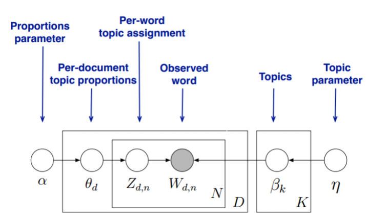
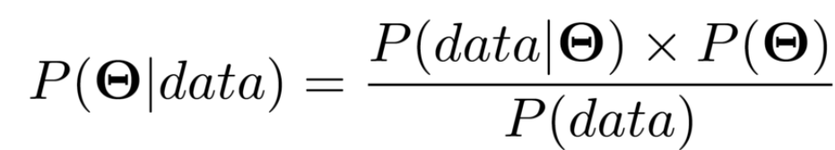
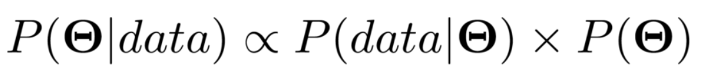
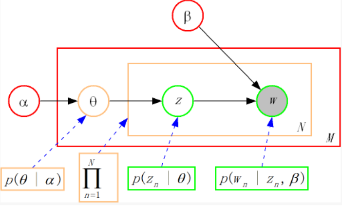

[toc]
#### 1. Matrix Data Structures
Matrix is an essential concept that is employed always in Machine Learning tasks in which the format to represent the matrices data structures in Python project are however variant. There are several naive ways to implement the matrices while coding om python projects:
- **Dictionary tof Keys**. Keys contain row indices and column indices corresponding to the mapped values.
- **List of Lists**. An nested data structure in which the rows are stored as a list, where sublist are colunms' value.
- **Coordinate List**. The tuple data structure is used to store row indices, column indices and the value.

###### 1.1 Dense Matrix
The common way to create a matrix is in **list of list** format.

```
[[1 0 0 1 0 0]
 [0 0 2 0 0 1]
 [0 0 0 2 0 0]]
```
What can be observed is that the values can be mostly zero when it comes to NLP scenery, which in the perspective of memory usage is disappointed. To solve the potential performance issue, Numpy and SciPy libraries could be the regular ways to avoid risks.

###### 1.2 Compresed Sparse Matrix

In SciPy, the data structure to for matrices are **Compressed Sparse Row** (csr_matrix) and **Compressed Sparse Column** (csc_matrix). These two data structures are the same. There have multiple ways to create the matrix, either by transferring regular dense matrix, set up row/column/values lists in the constructor, or set up data/indices/indices' pointers lists. This data structure is also widely employed to represent the matrices by other machine learning libraries such as Scikit Learn. Users can directly use the data structure and process it, for the method are automatically recognized by the encapsulated packages.
```
Name: text, dtype: object
  (0, 2)        2
  (0, 29)       1
  (0, 35)       1
  (0, 41)       3
  (0, 45)       1
  ...
```
---

#### 2. Experiments using TF-IDF
The tf-idf is an common data model mainly used in NLP field for vectorizing the natural language data for data pre-processing in machine learning. Unlike the terms frequency (tf) approach, the inverse document frequency (idf) factor is employed to diminish the weight of terms that occur frequently in the corpus and increase the weight of terms spotted rarely.

To implement tf-idf using Scikit-kearn Lib, there are two ways to achieve this goal:
- **CountVectorizer + Tfidftransformer**
- **Tfidfvectorizer**

The two approaches aim to do the same thing - convert the raw corpus to a matrix of tf-idf values. The first approach firstly convert the raw data into the words count vector and using the tfidf module to fit it. The second approach directly fit and transform the raw document into the t-idf scores, which is shorter. 

###### 2.1 CountVectorizer + Tfidftransformer
READ the csv file and print the first 10 lines of 'text' columns
```py
    import pandas as pd

    df = pd.read_csv('yelp_BR.csv')
    print(df.head(10)['text'])
```

```
Output:

0    Been coming here since I was in grade 9 so abo...
1    Love Wetzel's pretzels! I always get them when...
2    So why would I be giving a Fast Food chain loc...
3    We just recently discovered this place and I j...
4    This place is absolutely wonderful. The servic...
5    I am rating this Five Guys as a comparison to ...
6    Do not stop here if you are wanting fast food....
7    Why is your chicken so salty and your fries so...
8    Normally I wouldn't write a review on a sandwi...
9    I read a couple of reviews on the smoked meat ...
```
Instantialize the constructor of CountVector, fit and transform with the raw documents from the reviews.
```py {.line-numbers}
    # INITIALIZE the word count constructor
    cv=CountVectorizer()

    # Fit with raw documents
    word_count_vector=cv.fit_transform(df['text'])
    
    print(type(word_count_vector))  
    print(word_count_vector)

```
```
Output:

<class 'scipy.sparse.csr.csr_matrix'>
  (0, 203)      4
  (0, 412)      1
  (0, 892)      5
  (0, 1708)     2
  (0, 2087)     3
  :     :
  (9, 1450)     1
  (9, 1259)     1
  (9, 1783)     1
```
Print out the IDF weights for each vocabulary.
```py {.line-numbers}
    from sklearn.feature_extraction.text import CountVectorizer
    from sklearn.feature_extraction.text import TfidfTransformer
    

    tfidf_transformer=TfidfTransformer(smooth_idf=True,use_idf=True) 
    tfidf_transformer.fit(word_count_vector)

    df_idf = pd.DataFrame(tfidf_transformer.idf_, index=cv.get_feature_names(),columns=["idf_weights"]) 
    df_idf.sort_values(by=['idf_weights'])
    print(df_idf)

```

```
Output:
               idf_weights
able              2.011601
absolute          2.704748
absolutely        1.788457
acceptable        2.299283
accommodating     2.704748
...                    ...
younger           2.299283
yukon             2.704748
yummy             2.011601
zero              2.704748
zucchini          2.704748
```
Print out the TF-IDF score matrix.
```py {.line-numbers}
    tfidf = tfidf_transformer.transform(word_count_vector)
    print(tfidf)
    print(type(tfidf.todense()))
```

```
Output:

<class 'numpy.matrix'>
[[0.         0.         0.         ... 0.         0.         0.        ]
 [0.03184247 0.         0.         ... 0.         0.         0.        ]
 [0.02959796 0.         0.         ... 0.         0.         0.03979667]
 ...
 [0.         0.         0.         ... 0.         0.         0.        ]
 [0.         0.         0.01160592 ... 0.         0.         0.        ]
 [0.         0.         0.01899571 ... 0.02136578 0.         0.        ]]
```
###### 2.2 Tfidfvectorizer
The implementation shows below:
```py {.line-numbers}
    from sklearn.feature_extraction.text import TfidfVectorizer 
    
    tfidf_vectorizer=TfidfVectorizer(use_idf=True) 
    tfidf_vectorizer_vectors=tfidf_vectorizer.fit_transform(docs)
```
---
#### 3. Experiments using LDA
In natural language processing, the latent Dirichlet allocation (LDA) is a generative statistical model that allows sets of observations to be explained by unobserved groups that explain why some parts of the data are similar. - Wikipedia

To understand LDA model (topic model), some statistical concepts should check out first. Instead of writing a complete tutorial about LDA in detail, I will illustrate it in short given sufficient information. 

The topic model is a generative model that each word in each document is chosen from random topics through probability distributions. A document could be consisted of many topics, whereas a topic can be made in many words. In the perspective of computer programs, the implementation format is in matrices multiplication. A vector can represent a distribution; a matrix can also represent a distribution because each row or column can be a distribution.


The model follows a Bayes Estimator that contains Posterior distribution, Prior distribution, and likelihood. The model sets off with default $\alpha$ and $\eta$ to initialize the shape of the Dirichlet distribution on document-topic distribution and topic-word distribution. These two are the distribution of distribution.




To apply the Bayes Estimator workably, the posterior and prior have to be both from the same distribution family means that they are called conjugate distributions. Therefore in LDA, the document-topic distribution is multinominal distribution, the same as the topic-word distribution.


---

###### 3.1. Scikit-learn LDA module
In Scikit-learn package, it provides an LDA module using the EM algorithm to implement it. In the use of the actual scene, we care about how to model the raw documents, so this package allows us to convert the raw documents into **document-topic distribution** and **topic-word distribution**:
```py {.line-numbers}
    from sklearn.feature_extraction.text import CountVectorizer
    from sklearn.decomposition import LatentDirichletAllocation

    # INSTANTIATE an countvector to calculate the terms frequrency
    cv=CountVectorizer() 
    word_count_vector=cv.fit_transform(df['text'])

    # SETS the topics number as 300
    lda = LatentDirichletAllocation(n_components=300,
                                learning_offset=50.,
                                random_state=0)
    docres = lda.fit_transform(word_count_vector)

    print(docres)
    print(docres.shape)
    print(lda.components_)
    print(lda.components_.shape)
```
Print out the document-topic distribution with its shapes:
```
Output:

[[1.61812298e-05 1.61812298e-05 1.61812298e-05 ... 1.61812298e-05
  1.61812298e-05 1.61812298e-05]
 [1.30208333e-05 1.30208333e-05 1.30208333e-05 ... 1.30208333e-05
  1.30208333e-05 1.30208333e-05]
 [7.26216412e-06 7.26216412e-06 7.26216412e-06 ... 7.26216412e-06
  7.26216412e-06 7.26216412e-06]
 ...
 [6.37348630e-06 4.77162588e-02 6.37348630e-06 ... 6.37348630e-06
  6.37348630e-06 6.37348630e-06]
 [2.63921879e-06 2.63921879e-06 2.63921879e-06 ... 2.63921879e-06
  2.63921879e-06 2.63921879e-06]
 [5.48245614e-06 5.48245614e-06 5.48245614e-06 ... 5.48245614e-06
  5.48245614e-06 5.48245614e-06]]
  (10, 300)
```
Print out the topic-word distribution with its shapes:
```
Output:

[[0.00333333 0.00333333 0.00333333 ... 0.00333333 0.00333333 0.00333333]
 [0.00333333 0.00333333 0.00333333 ... 2.05308041 0.00333333 0.00333333]
 [0.00333333 0.00333333 0.00333333 ... 0.00333333 0.00333333 0.00333333]
 ...
 [0.00333333 0.00333333 0.00333333 ... 0.00333333 0.00333333 0.00333333]
 [0.00333333 0.00333333 0.00333333 ... 0.00333333 0.00333333 0.00333333]
 [0.00333333 0.00333333 0.00333333 ... 0.00333333 0.00333333 0.00333333]]
(300, 1781)
```

### 4. References

- [A Gentle Introduction to Sparse Matrices for Machine Learning](https://machinelearningmastery.com/sparse-matrices-for-machine-learning/)
- [How to Use Tfidftransformer & Tfidfvectorizer?](https://kavita-ganesan.com/tfidftransformer-tfidfvectorizer-usage-differences/#.X1lKrNZFybj)
- [Wikipedia LDA](https://en.wikipedia.org/wiki/Latent_Dirichlet_allocation)
- [Probability concepts explained: Bayesian inference for parameter estimation.](https://towardsdatascience.com/probability-concepts-explained-bayesian-inference-for-parameter-estimation-90e8930e5348)