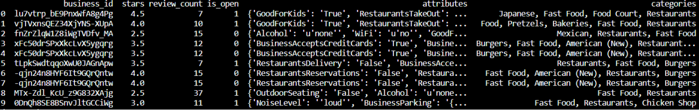
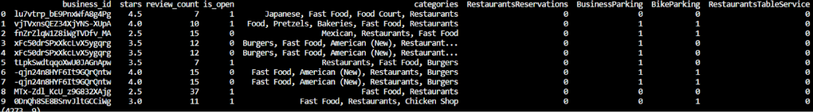
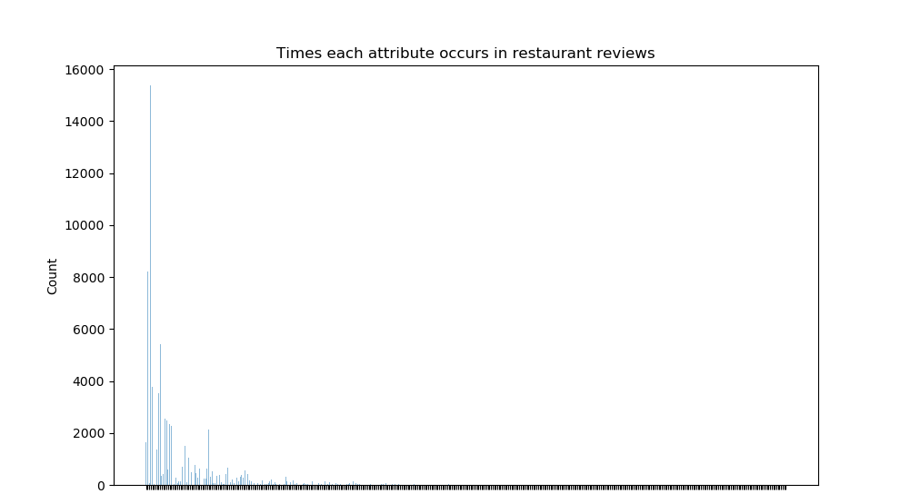
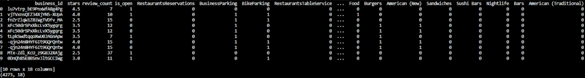
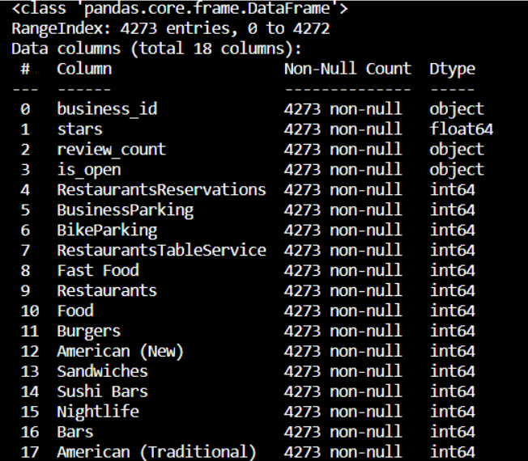
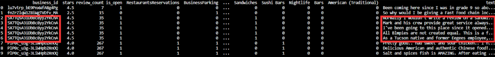
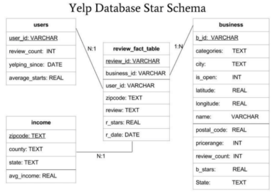
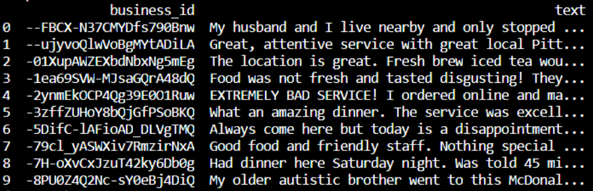
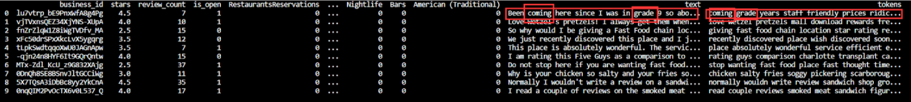

**Content Table:**
[TOC]
---


### 1. Installation
**1.1. Tools and Libraries**
    Python 3.8.1 32-bit
    **Visual Studio Code**
    Numpy
    Pandas
    Sklearn
    Gensim
    Nltk
    
**1.2. Installation** 
(The dataset has to be placed in the same directory of the python file, this zip file does not contains the Yelp dataset)
    1. Unzip the zip file
    2. Open VSCode folder on the current directory
    3. *Make Sure all libraries are installed in python directory
    4. Run it 

The current codes enable processing dataset with 50,000 records of restaurant reviews, the final result is around 5,000 which are sufficient for later steps of prediction and regression. The tasks would be continually moving on to data modeling and data regression & classification.


### 2. Main tasks Date Cleaning

**2.1. Converting liness for json into CSV file**

This is an additional process meant for transferring the JSON file into the CSV type of file that we are familiar with. It is no doubt that directly processes the JSON file is also a quick approach, but here we attached such implementing codes for a quick reference.

```py {.line-numbers}

# read json chunk stream, and tranlate the Yelp Reviews into CSV file
# lib json convert json into dict

def converter(json_file_path, csv_file_path):
    with open(json_file_path,'r',encoding='utf-8') as fin:
        for line in fin:
            line_contents = json.loads(line)
            break
        # print(headers)
    with open(csv_file_path, 'w', newline='',encoding='utf-8') as fout:
        writer=csv.DictWriter(fout, headers)
        writer.writeheader()
        with open(json_file_path, 'r', encoding='utf-8') as fin:
            for line in fin:
                line_contents = json.loads(line)
                writer.writerow(line_contents)
```


**2.2. Reading large size JSON file**
Due to the memory issue, the Yelp Reviews dataset is too large (6GB) to process in 1 pass in current memory. The solution is to read dataset in chunks, process each chunk at a time, and finally concatenate the results.

There are two implementing ways to read chunks:

**Method 1: Use Append**
```py {.line-numbers}
    # 1. READ Yelp Business JSON into chunks stream
    df = pd.DataFrame()
    for chunk in reader:
        df = df.append(chunk)

```

**Method 2: List of Chunk Concatenate**

```py {.line-numbers}
    chunk_list = []
    for chunk in review_readers:
        # Drop columns
        chunk_list.append(chunk)
    df = pd.concat(chunk_list, axis = 0)
```

**2.3. Select subset of dataset in categories of "Fast Food", "Sushi Bars" and "American(New) Food"**

We are only interested in looking for restaurants that are selling above categories' food. 

```py {.line-numbers}
for i in range(0, 50000):
    # for i in range(0, len(df)):
        cat = df.iloc[i, :]['categories']
        # print(cat)
        if 'Fast Food' in cat:
            df_new = df_new.append(df.iloc[i, :], ignore_index = True )        
        if 'Sushi Bars' in cat:
            df_new = df_new.append(df.iloc[i, :], ignore_index = True )        
        if 'American (New)' in cat:
            df_new = df_new.append(df.iloc[i, :], ignore_index = True )
```


**2.4. Extract categorical attributes from "Attributes" and create new feature space**

In this task, we are expected to find out the restaurants that have at least one attribute from list below, but first of all, we need to check how many restaurants fits our expectation among all restaurants.

- RestaurantsReservations
- BusinessParking
- BikeParking
- RestaurantsTableService

Since not every restaurant has all 4 attributes required, it is crucial to identify the ones that need to be valuable for including in new feature space.

```py {.line-numbers}
# Image 2.1: Show maximum number of attributes    
   
    # 5. CHECK if each restaurants has one or more required attributes
    attributes = ['RestaurantsReservations', 
                    'BusinessParking', 
                    'BikeParking', 
                    'RestaurantsTableService']    
    # attributes = ['RestaurantsReservations']
    counter = 0
    counter2 = 0
    for i in range(0, len(df_new)):   
        ats = df_new['attributes'][i].keys()
        contain = [x for x in attributes if x in ats]
        if (len(contain) == 4):
            counter += 1
        if len(contain) >= 1:
            counter2 += 1
    print("Number of restaurants containing all attributes:  ", counter)
    print("Number of restaurants containing at least one of attributes:  ", counter2)
    print("Total Number of restaurants:  ", len(df_new))
```


**Image 1**: Select restaurants that have sushi bar/american(new)/fast food tags

After reading the JSON file and translate it into the dataframe using the Pandas library, the Attributes feature becomes a dictionary data structure. As we know, JSON has a nested structure that a value matching a key can be another object in key values pairs set. When it comes to the dictionary data structure in Python, it is not the same story. This means the dictionary we get from JSON would not able to keep the JSON nested structure anymore. All sub-object that is 1 level away would be treated as a String type. So, in our implementation of checking some attributes, it has to check the string for some cases.


```py {.line-numbers}
    # In this case, we look for BusinessParking in dictionary
    if 'BusinessParking' in df_new['attributes'][i].keys():
        if 'True' in df_new['attributes'][i]['BusinessParking']:
            df_newfeatures.loc[i,'BusinessParking'] = 1
        else:
            df_newfeatures.loc[i,'BusinessParking'] = 0
```


**Image 2**: Selects restaurants that have reservation/parking/Service tags in Attributes 

```py {.line-numbers}
    # TRANSFER string categories into List of categories
    categories = []
    for i in range(0, len(df_new)):
        df_new['categories'].iloc[i] = df_new['categories'].iloc[i].split(',')
        df_new['categories'].iloc[i] = [x.strip() for x in df_new['categories'].iloc[i]]
        categories = categories + [x for x in df_new['categories'].iloc[i] if x not in categories]

    # CREATE new Categories dataframe
    df_newcat = pd.DataFrame(0, index=np.arange(len(df_new)), columns=categories)
    for i in range(0, len(df_new)):
        for j in df_new['categories'].iloc[i]:
            df_newcat[j].iloc[i] = 1

    # CONCATENATION Join
    df_new = pd.concat([df_new, df_newcat], axis = 1, join = 'inner')
    # REMOVE old attributes feature
    df_new = df_new.drop('categories', axis = 1)

```


**2.4. Extract Categories from "Categories" and create new feature space**

Every restaurant has a different combination of the same categories, so we will need to pick categories that are mostly spotted and attached to restaurants to balance data avoiding sparse dataset and over-fitting issues.

```py {.line-numbers}
    plt.figure(figsize=(10, 6))
    plt.bar(attributes2, tally, align='center', alpha=0.5, width=0.5)
    plt.xticks(attributes2, attrs, rotation='vertical')
    plt.ylabel('Count')
    plt.title('Times each attribute occurs in restaurant reviews')
    plt.show()
```

**Image 3**: Histogram for all categories

After pruning categories, the restaurants tables become as below:


**Image 4**: Restaurants with newly created feature space

The left categories features in the dataframe:

**Image 5**: New features extracted from categories

**2.4. Extract Categories from "Categories" and create new feature space**

```py {.line-numbers}
    # TRANSFER string categories into List of categories
    categories = []
    for i in range(0, len(df_new)):
        df_new['categories'].iloc[i] = df_new['categories'].iloc[i].split(',')
        df_new['categories'].iloc[i] = [x.strip() for x in df_new['categories'].iloc[i]]
        categories = categories + [x for x in df_new['categories'].iloc[i] if x not in categories]

    # CREATE new Categories dataframe
    df_newcat = pd.DataFrame(0, index=np.arange(len(df_new)), columns=categories)
    for i in range(0, len(df_new)):
        for j in df_new['categories'].iloc[i]:
            df_newcat[j].iloc[i] = 1

    # CONCATENATION Join
    df_new = pd.concat([df_new, df_newcat], axis = 1, join = 'inner')
    # REMOVE old attributes feature
    df_new = df_new.drop('categories', axis = 1)

```

**2.5. Groupby to concatenate strings in Yelp Reviews to Yelp Business**
The relation between Yelp Business and Yelp Reviews is 1:N, so in order to save all reviews under a single restaurant is to concatenate all reviews into a single string.

**Image 6**: Yelp Reviews dataset with 1:N on restaurants' ids to reviews

**Image 7**: Yelp Dataset Schema overall

The way to concatenate is to Inner join two dataset for each chunk, and do one more same procedure since we have multiple passes to process the dataset, duplicate restaurants would be counted multiple times.

```py {.line-numbers}
    chunk_list = []
    for chunk in review_readers:
        # Drop columns
        chunk = chunk.drop(['user_id', 
                            'review_id', 
                            'date', 
                            'stars', 
                            'useful', 
                            'funny', 
                            'cool'], 
                        axis = 1)
        # Inner join Yelp_Business and Yelp_review, and GroupBy the reviews string in each chunk dataframe
        chunk_merged = pd.merge(df_B, chunk, on='business_id', how='inner')
        chunk_list.append(chunk_merged.groupby('business_id')['text'].apply('#'.join).reset_index())

    # GroupBy the reviews string among all chunks' dataframes
    dff = pd.concat(chunk_list, axis = 0).groupby('business_id')['text'].apply('.'.join).reset_index()                  

    # Concatenate new Feature space as Reviews tables to Yelp Business
    df = pd.merge(df_B, dff, on='business_id', how='inner').reset_index()
```

The final reviews dataframe would be looks like this:

**Image 8**: Restaurants Groupby calling on string aggregation

**Image 9**: Reviews steamming and filerting


### 3. References
**Yelp Dataset**
Schema:
[https://www.yelp.com/dataset/documentation/main](https://www.yelp.com/dataset/documentation/main)

Categories list:
[https://blog.yelp.com/2018/01/yelp_category_list](https://blog.yelp.com/2018/01/yelp_category_list)

**Approaches**
Basic Data cleaning for creating feature space from 'Attributes' and 'Categories':
[http://jasontdean.com/python/Yelp.html](http://jasontdean.com/python/Yelp.html)
Yelp Dataset Challenge:
[https://www.ics.uci.edu/~vpsaini/](https://www.ics.uci.edu/~vpsaini/)

**Implementation and Techniques**
Read JSON:
[https://pandas.pydata.org/pandas-docs/stable/user_guide/io.html](https://pandas.pydata.org/pandas-docs/stable/user_guide/io.html)

Read chunks:
[https://towardsdatascience.com/converting-yelp-dataset-to-csv-using-pandas-2a4c8f03bd88](https://towardsdatascience.com/converting-yelp-dataset-to-csv-using-pandas-2a4c8f03bd88)
[https://qastack.cn/programming/25962114/how-do-i-read-a-large-csv-file-with-pandas](https://qastack.cn/programming/25962114/how-do-i-read-a-large-csv-file-with-pandas)

Groupby:
[https://stackoverflow.com/questions/38127209/how-to-use-groupby-to-concatenate-strings-in-python-pandas](https://stackoverflow.com/questions/38127209/how-to-use-groupby-to-concatenate-strings-in-python-pandas)
[https://stackoverflow.com/questions/27298178/concatenate-strings-from-several-rows-using-pandas-groupby](hhttps://stackoverflow.com/questions/27298178/concatenate-strings-from-several-rows-using-pandas-groupby)

Reset Label after Groupby:
[https://stackoverflow.com/questions/50966042/cant-find-column-names-when-using-group-by-function-in-pandas-dataframe](https://stackoverflow.com/questions/50966042/cant-find-column-names-when-using-group-by-function-in-pandas-dataframe)

Iterate lines:
[https://stackoverflow.com/questions/16476924/how-to-iterate-over-rows-in-a-dataframe-in-pandas](https://stackoverflow.com/questions/16476924/how-to-iterate-over-rows-in-a-dataframe-in-pandas)
